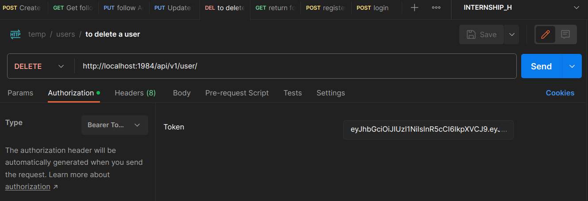

# Social Media API Documentation

Welcome to our Social Media API documentation. This API provides endpoints for user management and post interactions, facilitating the functionality of a social media platform. Below are the details of each endpoint along with their use cases.

---

**Base URL:** `https://nodejs-social-media-api-45nj.onrender.com/api/v1/`

#### Demo user : mailtomohit2002@gmail.com
#### password : Mohit123*

#### Sample posts ids for performing CRUD operation : 65f588283b4d7eac9fa87e8b , 65f5884b3b4d7eac9fa87e8f
(create more for testing purposes).

## User Routes

**Authentication Required:** No

1. **POST /user/register**
   - Use this endpoint to register a new user.
   - Request Body Parameters:
     - `name` (string): The name of the user.
     - `email` (string): The email address of the user.
     - `password` (string): The password for the user account.
   - Response Body Format:
     - `success` (boolean): Indicates whether the registration was successful.
     - `data` (object): Contains the user data if registration is successful along with the link to verify the email.

2. **POST /user/login**
   - Use this endpoint to log in an existing user.
   - Request Body Parameters:
     - `email` (string): The email address of the user.
     - `password` (string): The password for the user account.
   - Response Body Format:
     - `success` (boolean): Indicates whether the login was successful.
     - `token` (string): JWT token for authenticated user.

**Authentication Required:** YES (Include Bearer Token in header)

3. **GET /user**
   - Use this endpoint to retrieve user information.
   - Response Body Format:
     - User object containing user details.

4. **PUT /user**
   - Use this endpoint to update user information.
   - Request Body Parameters:
     - `name` (string, optional): The updated name of the user.
     - `email` (string, optional): The updated email address of the user.
   - Response Body Format:
     - `success` (boolean): Indicates whether the update was successful.
     - `data` (object): Contains the updated user data.

5. **DELETE /user**
   - Use this endpoint to delete the user account.
   - Response Body Format:
     - `status` (string): Indicates the status of the operation.

6. **GET /user/follow/:userId**
   - Use this endpoint to follow another user.
   - Response Body Format:
     - `status` (string): Indicates the status of the operation.

7. **GET /user/unfollow/:userId**
   - Use this endpoint to unfollow another user.
   - Response Body Format:
     - `status` (string): Indicates the status of the operation.

8. **GET /user/getFFdetails/**
   - Use this endpoint to retrieve followers and following details.
   - Response Body Format:
     - `success` (boolean): Indicates whether the operation was successful.
     - `followers` (array): Array of followers' details.
     - `following` (array): Array of following users' details.

## Post Routes

**Authentication Required:** Yes

1. **POST /post**
   - Use this endpoint to create a new post.
   - Request Body Parameters:
     - `text` (string): The content of the post.
   - Response Body Format:
     - `success` (boolean): Indicates whether the post creation was successful.
     - `data` (object): Contains the created post data.

2. **GET /post**
   - Use this endpoint to retrieve posts from users the current user follows.
   - Response Body Format:
     - `success` (boolean): Indicates whether the operation was successful.
     - `data` (array): Array of posts from followed users.

3. **GET /post/:id**
   - Use this endpoint to retrieve a specific post by its ID.
   - Response Body Format:
     - `success` (boolean): Indicates whether the operation was successful.
     - `post` (object): Contains the details of the retrieved post.

4. **PUT /post/:id**
   - Use this endpoint to update a specific post by its ID.
   - Request Body Parameters:
     - `text` (string): The updated content of the post.
   - Response Body Format:
     - `success` (boolean): Indicates whether the update was successful.
     - `data` (object): Contains the updated post data.

5. **DELETE /post/:id**
   - Use this endpoint to delete a specific post by its ID.
   - Response Body Format:
     - `success` (boolean): Indicates whether the deletion was successful.
     - `data` (string): Confirmation message.

---

This API provides essential functionalities for managing users and posts in a social media platform. Make sure to include the JWT token in the headers for authenticated requests. If you have any questions or need further assistance, feel free to contact our support team. Happy coding!